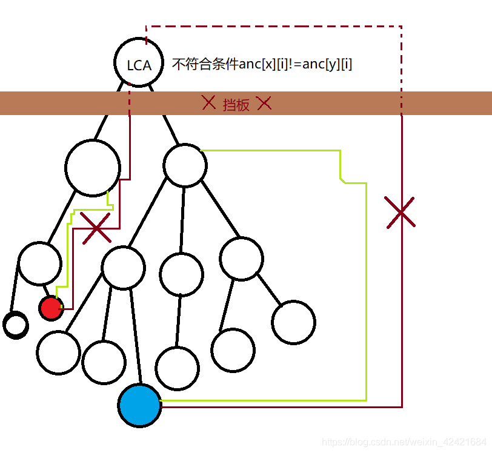
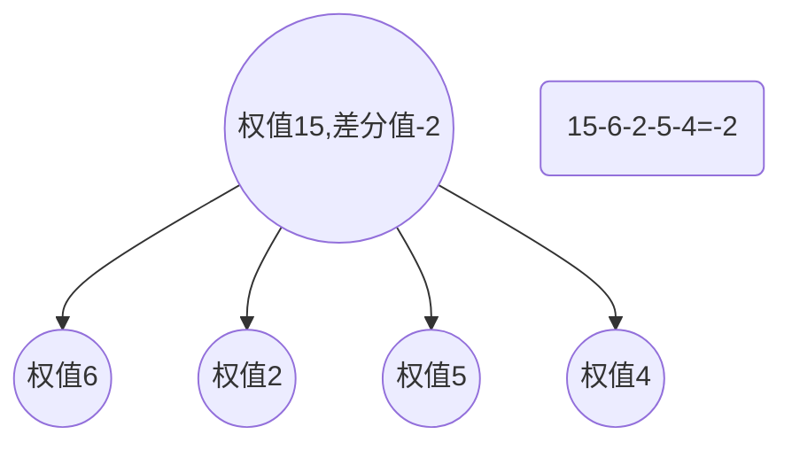
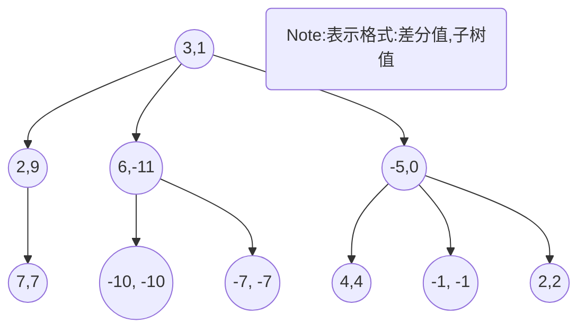
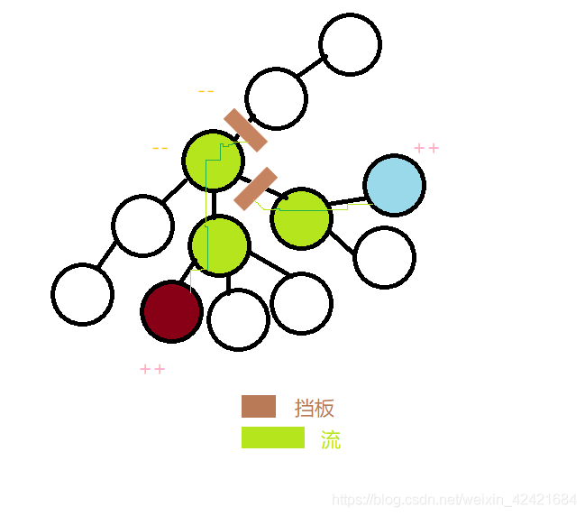

树上差分自己不算难
> （~~难的是天天爱跑步~~ ）

先说差分数组。
这个玩意，就是差分数组里的每一个值等于原数组这个位置的值减去原数组这个位置前面的值，但差分数组第一个值等于原数组第一个值。
估计童鞋们看不懂(◎﹏◎)
为此，我特意准备了栗子<(￣︶￣)↗[GO!]
原数组a:    9  3 5  2 7
差分数组b:9 -6 2 -3 5
所以除了第一个特例，b[i]=a[i]-a[i-1] QwQ

但是，，，差分数组除了麻烦就是麻烦？那这个玩意就流行不起来了，肯定还是有利处，请往下看↓。
一道题，有n次操作，每一次要在[ l[n] , r[n] ]的区间内每一个数+x,x也可以是负数。
~~这也忒简单了吧！遍历l，r区间不就得了！跟这有什么关系？(╬▔皿▔)凸¬_¬
抱歉，就怕时间复杂度超了~~
当n增多之后，可能就要超时，后果自负 QwQ
所以？**差分数组正式登场也！**
差分数组求这道题分为三大部分：

 1. 预处理：原数组->差分
 2. n次操作
 3. 后期处理：求前缀和（差分->原数组）
 预处理方法已经说了，重点探讨2. 3.
 n次操作，就先一次吧（~~多次 一讲着麻烦，二听不懂，三我很懒QwQ~~ )
 以下l,r都指l[0],r[0]，因为只有一次。
 方法就是b[l]+=x,b[r+1]-=x.
 或者去捡栗子（~~掉地了还能吃吗~~
 比如我们要在[1,3]区间+1
 那么9 -6 2 -3 5变成9 -5 2 -3 4
 (⊙_⊙)？
 Why？
 因为-6=3-9,但是目标里3加了一，相当于：3+1-9，当然结果也加1，相反过来结果加1，9没动，3也就理想上加了一；简单说被减数加一，结果加一。
 中间因为式两边都加所以差不变
 b[r+1]个呢？因为减数加一，所以结果减一，反之亦然。
 差分数组操作竟然这么简单！时间复杂度O(1)！！！( •̀ ω •́ )y
 别着急，还有一步，~~前缀和~~ 。
 反正就是新的b推出新的a。
 b[i]=a[i]-a[i-1],那a[i]=b[i]+a[i-1]
 ~~栗子是不是又掉地了？pickitup!~~
 如果i=1，那3=-6+9，而a[0]=b[0]=9，所以可以改成：a[1]=b[0]+b[1]
 如果i=2，那a[2]=b[2]+a[1],但a[1]=b[0]+b[1],所以a[2]=b[0]+b[1]+b[2]
 如果i=3，那a[3]=b[3]+a[2],但a[2]=b[0]+b[1]+b[2],所以a[3]=b[0]+b[1]+b[2]+b[3]
 发现了其中的规（mì）律（mì）了吗？
 所以！$$
a_i=\sum\limits_{k=0}^i b_k
 $$
 推出后即完成此题。
 这个就是差分数组。
---------------
 下面开始BB树上差分，
 前面所有均是为以下做铺垫（~~是不是感觉还以为上面多重要，还细细的扣，结果落空╰（‵□′）╯？）~~ 。。。请往下↓。
 树上差分需要求LCA，即最近公共祖先。
 我看的好多文章说LCA时都是一个链接过去，我只能进去看，看完了在回来看这个，我也懒得跑递归QwQ，正好也别让童鞋跑递归。。。2333
 这里就详细介绍介绍
 巨体思想 先把深度抬到一样高，然后一起往上 跳|爬 （借用了正则表达式符号d=====(￣▽￣)b）
 有两种方法
1.蜗牛型一步一步往上爬的暴力求解（~~一提到暴力，总是超时间的典型~~ ）
2.青蛙型一步一步往上跳的倍增求解
蜗牛：没啥可说的，俩字：**超时！**
青蛙：大体思想（~~知道前面为什么用**巨**了吧~~ ）：
移动速度要快！跳着走！
先预处理，
设数组$anc_{i,j}=i往上走2^j个$,$fa_i=The Father Of I$，$deep_i=i的深度$
求出这些即可。
```c
//基本转载：https://www.cnblogs.com/sllr15/p/5164996.html
int anc[1005][25];
int fa[1005];
vector <int > tree[1005];//tree[i]包含其子节点们
int deep[1005];

void dfs(int x)
{
    anc[x][0]=fa[x];
    for (int i=1;i<=int(log(deep[x])/log(2));i++)
    {
        anc[x][i]=anc[anc[x][i-1]][i-1];
       /*
		超链接：“青蛙路线递推式”
       */
    }

    for (int i=0;i<tree[x].size();i++)
    {
        if (tree[x][i]!=fa[x])
        {
            int y=tree[x][i];
            fa[y]=x;//记录父亲节点
            deep[y]=deep[x]+1;//记录深度
            dfs(y);
        }
    }
}

```
青蛙路线递推式：i往上跳$2^j$个等于i往上跳$2^{j-1}$个然后再跳$2^{j-1}$,等于i往上跳$2\times2^{j-1}=2^j$

然后要抬到一个深度，
栗子：深度一个在3，一个在8.
那么就是一次尽量多跳（但必须是2^x^)，先从大的试。
试4，OK，跳上去，然后再试1，跳到3.
从哪里开始试？每次试几？怎么知道时间复杂度超否？etc...
燃鹅，这个方法差劲！
那谁来替之？
_位操作！_
<mark>定律1：所有正整数均可以表示为2^某^之和，比如$3=2^1+2^0,7=2^2+2^1+2^0,41=2^5+2^3+2^0$等，并且二进制里一位只要有一，那么这个数一定有2^第几位?^这一项。第几位指从右数起并且最右端为0</mark>
栗子里深度差为5，那么其二进制为101，寓意着跳2^0^后跳2^2^,顺序其实不重要。
```c
if(deep[y]>deep[x])swap(x,y);//我希望x更深
int dif=deep[x]-deep[y];//dif为深度差
for(int i=0;i<(int(log(dif)/log(2))+1);i++){
	if(1<<i & dif)x=anc[x][i];
}
```
for循环处log那里用到了换底公式，反正就是求$Log_2dif$。
后面跟着一个普（qí ）通 （miào)的+1。
令$l(x)=\lfloor Log_2x\rfloor$
Why上面需要加一？
因为我发现：
栗子：dif在[4,7],l(dif)均等于2，而我们要求位数（二进制里），它们都是3位，所以要+1。
这里是为了方便理解而已，也可以改成for(int i=0;i<=int(log(dif)/log(2));i++)
然后就一起跳。
思路：从大起 试i，以0为终，如果有一次anc[x][i]!=anc[y][i]，①那么说明这里没汇集到一起，所以跳上去，然后继续。②如果这里汇集了（anc[x][i]==anc[y][i]），那么就不管它，往小了试。最终anc[x][0](~~如果你有强迫症，anc[y][0]也可以~~）就是结果，因为最后肯定它们的父节点汇集到一起了。
肯定？Where is验证？不可信！QwQ
根据定律1，假设x、y点互不为祖先，那么dif-1一定可以表示为2^某^之和。根据前面的条件，如果anc[x][i]==anc[y][i]，那么 <mark>不跳上去</mark>，谁管你是不是LCA，你要是LCA也是第一个汇集点，也是汇集点，也就不跳(￣y▽,￣)╭ 。那么anc[x][i]|anc[y][i]要不幸运碰到了LCA（或以上），都往小试，最后也就顶到LCA底下那一层。简单来说：先看代码：

```c
//基本转载：https://www.cnblogs.com/sllr15/p/5164996.html
//这个是在函数里 这个是在函数里 这个是在函数里！
/*
这个是在函数里！
这个是在函数里！
这个是在函数里！
*/
    if (x==y) return x;//如果Y是X的祖先，就可以直接返回结果了。

    for (int i=int(log(deep[x])/log(2));i>=0;i--)
    {
        if (anc[x][i]!=anc[y][i]) //第二步。
        /*
        如果蹦到LCA或以上，是不符合条件的，所以在LCA处有一挡板，跳不上去，图超链接：挡板
        */
        {
            x=anc[x][i];
            y=anc[y][i];
        }
    }

    return anc[x][0];//注意第二步IF语句的条件。
```
挡板：

看见了么？所以挡板将会把x和y挡在挡板下面，所以知道为什么要取之父了吧
这样LCA就讲完了。
正题，树上差分来了。
又题：一棵树上，有n多次操作，每一次要在两点间的路径上所有经过点的权值加一，最后问所有点的权值，洛谷上也有[类似的题目](https://www.luogu.org/problem/P3258)可以练手。
暴力求解不用提了吧，肯定超时。（~~对！就是超时的形象、超时的典型！应该配一个超时风格的音乐！）~~
还是老办法，先一次。
咦？树上的差分数组？线性表可以差分，树怎么差分？
定义差分数组cnt，原数组a。那么$cnt_i=a_i-\sum\limits_{k=0}^{tree_i.length()-1}a_{(tree_{i,k})}$,就是差分数组上每一个值等于其真实权值-子节点1权值-子节点2权值-子节点3权值-...
叶子结点的差分值等于它自己的原权值（类似前面差分数组的“第一个特例”）
栗子：


那么先说怎么求每个节点的真实权值。
前面的差分数组是前缀和，这里变成了子树和。每一个节点的真实权值等于自己的所有子孙（这里包括自己）的差分值之和。
~~捡起栗子炒一炒，该吃了。~~
根据之前的栗子，那么那个大大的节点的子树和即-2+6+2+5+4=15。是不是很神奇？ヾ(≧▽≦*)o
再栗子：


怎么求子树和知道了，现在回归正题。
方法就是cnt[x]++,cnt[y]++,cnt[lca(x,y)]- -,cnt[fa[lca(x,y)]]- -。
为什么？
差分数组里一个值++相当于一个“流”向上跑。
差分数组里一个值--相当于拦截跑上来的流之一。
一个地方被流过几次权值就是几。
附背后解读：
根据子树和，一个地方x++,那么上面所有的真实权值均+1，因为其中一个加数（x)+了一，结果也加一。
x的某祖先真值=...+0+0+1+0+0+...
如果有更多，那么加的也更多
x的某祖先真值=...+0+1+1+0+1+...//这里直接加三。
拿流来说，就是三个流汇集到一起，也就是权值为3，完全相同。但，如果x不是++而是- -，那么右式就-了一，会找一个+1抵消，<mark>但也可能没有，就成负数了</mark>，那么就相当于拦截流。
那拿流来解读上面的“方法就是...”那块儿。


或者换一个思想。cnt[x]++，那么a[x和其祖先]都++，因为根据子树和，自己和祖先都有了cnt[x]加数，并且它++了，所以结果都加一。
另外一边，cnt[y]++,那么a[y和其祖先]都++，同样道理。
咦？发现问题否？如果照这样下去那么cnt[lca(x,y)和其祖先]都成2了！因为它们既有加数x,又有加数y！直接+了2！反了！应该是lca是1，上面的管不着（都为零）才对。
如果cnt[lca]- -那么2就变成1，因为-1找了一个+1抵消。这时其祖先仍然为1.
如果cnt[fa[lca]]- -那么上面所有的包括自己都为0了，因为这次-1找了另外+1抵消。
完美解决！
最后深搜一遍求子树和就行了，
tips:边界条件（到达叶子节点）成立时，返回自己的值。如果不是，遍历子节点进行递归，将子节点的dfs返回值求和作为自己的返回值。
参考文献：https://www.cnblogs.com/sllr15/p/5164996.html，
https://www.cnblogs.com/cjoierljl/p/8728215.html......数不尽
既然我看了这么多篇文章，我也看的筋疲力尽，所以写的有点详细。。。（也许自己夸大自己了(＠_＠)）
有的地方++ - -的我都要说的很清楚，请不要嫌我BB。
最后：我写了差不多五千多字，能发表论文了吧，我也累死了。
全文终，（~~我也要吐血了，累得慌）~~ 。
